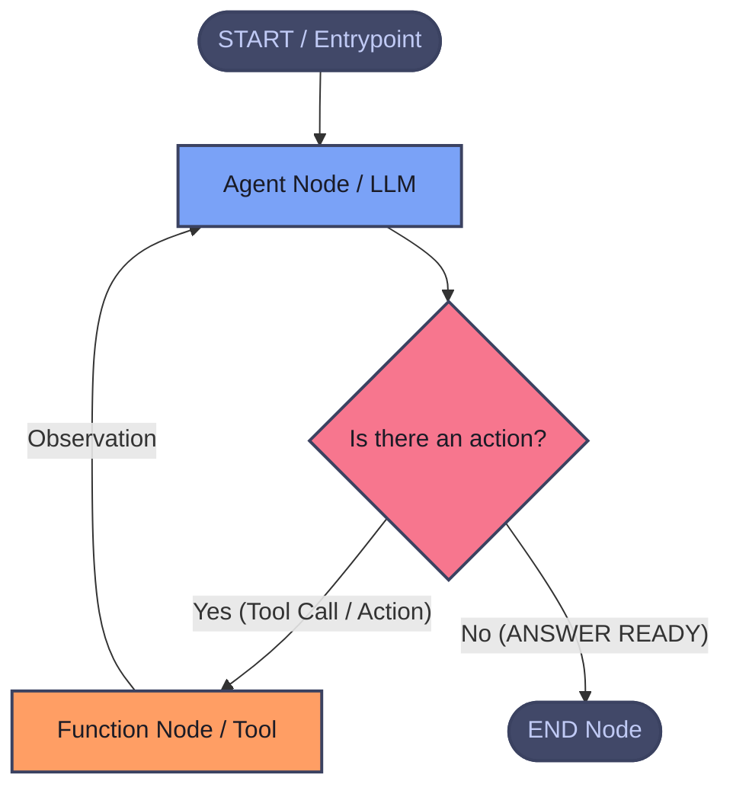

Date: 28.08.2026
Tags: #agents #LangChain #LangGraph
**Source:** [LangGraph Documentation](https://docs.langchain.com/oss/python/langgraph/graph-api)

---

**LangGraph is a Python library** that lets you define AI workflows as a **graph** — a set of **nodes** (actions/functions) connected by **edges** (transitions).

LangGraph’s underlying graph algorithm uses **message passing** to define a general program.When a Node completes its operation, it sends messages along one or more edges to other node(s). This single iteration is called super step.




### Keywords

**State:** A shared data structure that acts as the central memory for your agent workflow. (Agent's Short Term / Working Memory)
**Nodes:** Agent or funciton(tool, action, logic etc.)
**Edges:** Connection nodes 


To emphasize: `Nodes` and `Edges` are nothing more than functions—they can contain an LLM or just good ol’ code.

In short: _nodes do the work, edges tell what to do next_.

**Conditional Edges:** Decisions

Note: 

LangGraph uses Python's `TypedDict` to define the graph state because it provides type safety, clear data schemas, and runtime predictability.

When updating the state, LangGraph leverages `Annotated` along with **Reducer** functions:
- By default, returning a key from a node **overwrites** the existing state value.

- Using a reducer (such as `Annotated[list, operator.add]`) prevents overwriting and instead **appends** the new node output (e.g., new messages) to the existing list.
---
# Graph API overview

## **State**

State of the graph consists reducer functions (how to updates state) and schema to all graph nodes and edges (TypedDict or Pydantic)

## **StateGraph**

A `StateGraph` in LangGraph is the core builder class used to model agent workflows as a directed graph (State Machine). All participating nodes communicate by reading from and writing to a centralized, shared data structure known as the state. 

To build your graph, you first define the [state](https://docs.langchain.com/oss/python/langgraph/graph-api#state), you then add [nodes](https://docs.langchain.com/oss/python/langgraph/graph-api#nodes) and [edges](https://docs.langchain.com/oss/python/langgraph/graph-api#edges), and then you compile it.

### **Schemas**

Typically, all graph nodes communicate with a single schema. We can simply define a private schema, `PrivateState`. 

Define input and output schemas examples: 

```python
class InputState(TypedDict):
	 user_input: str 
 
 class OutputState(TypedDict): 
	 graph_output: str 
 
 class OverallState(TypedDict): 
	 foo: str user_input: 
	 str graph_output: str 
 
 class PrivateState(TypedDict): 
	 bar: str 
 
 def node_1(state: InputState) -> OverallState: # Write to OverallState return {"foo": state["user_input"] + " name"}
	 return {"foo": state["user_input"] + " name"}
```


###  **MessagesState** 

It provides this TypedDict schema inside: 

```python 
messages: Annotated[list[AnyMessage], add_messages]
```


## **Nodes**

https://docs.langchain.com/oss/python/langgraph/graph-api#nodes

In LangGraph, nodes are Python functions (either synchronous or asynchronous) that accept the following arguments:

1. `state`—The [state](https://docs.langchain.com/oss/python/langgraph/graph-api#state) of the graph
2. `config`—A [`RunnableConfig`](https://reference.langchain.com/python/langchain-core/runnables/config/RunnableConfig) object that contains configuration information like `thread_id` and tracing information like `tags`
3. `runtime`—A `Runtime` object that contains [runtime `context`](https://docs.langchain.com/oss/python/langgraph/graph-api#runtime-context) and other information like `store`, `stream_writer`, `execution_info`, `server_info`, `heartbeat` (for idle timeout refresh), and `control` (for [graceful shutdown](https://docs.langchain.com/oss/python/langgraph/fault-tolerance#graceful-shutdown))

#### **Re-execution and idempotency**

LangGraph saves checkpoints at [super-step](https://docs.langchain.com/oss/python/langgraph/graph-api#graphs) boundaries, not mid-function inside a node. If execution stops and later resumes (for example after an [interrupt](https://docs.langchain.com/oss/python/langgraph/interrupts) or a [retry](https://docs.langchain.com/oss/python/langgraph/fault-tolerance#retries)), the affected **node** runs again from the start of its function.

**Idempotency.** Design **node** logic so re-execution does not corrupt state. If a node inserts a database row, running it twice should not create duplicate rows unless that is intentional.

**Graph changes.** Code changes do not apply to graph structure. You can add or remove **nodes** and edges without breaking resume for existing threads. Resumed runs use saved state and execute whatever graph you compile now.

### Node caching

LangGraph supports caching of tasks/nodes based on the input to the node. To use caching:

- Specify a cache when compiling a graph (or specifying an entrypoint)
- Specify a cache policy for nodes. Each cache policy supports:
    - `key_func` used to generate a cache key based on the input to a node, which defaults to a `hash` of the input with pickle.
    - `ttl`, the time to live for the cache in seconds. If not specified, the cache will never expire.


>[!note] `set_entry_point(node)` defines the first node the graph will execute. It is equivalent to `builder.add_edge(START, node)`.`set_finish_point(node)` defines the last node in the graph. It is equivalent to `builder.add_edge(node, END)`.Both methods are valid but `add_edge(START, ...)` and `add_edge(..., END)` are the recommended modern syntax.


## Edges

Edges define how the logic is routed and how the graph decides to stop. This is a big part of how your agents work and how different nodes communicate with each other. There are a few key types of edges:

- Normal Edges: Go directly from one node to the next.
- Conditional Edges: Call a function to determine which node(s) to go to next.
- Entry Point: Which node to call first when user input arrives.
- Conditional Entry Point: Call a function to determine which node(s) to call first when user input arrives.

A node can have multiple outgoing edges. If a node has multiple outgoing edges, **all** of those destination nodes will be executed in parallel as a part of the next superstep.


#### **Send & OverallState**

`OverallState` is the global state schema (TypedDict/Pydantic) shared across the entire graph. Nodes read from and write to it.

`Send` is a routing primitive used with conditional edges to implement the **Map-Reduce** pattern dynamically:

- **Dynamic Fan-out:** Spawns multiple parallel node tasks at runtime when the exact count is not known ahead of time (e.g., mapping over a list of chunks).
    
- **Memory & State Isolation:** Passes only a lightweight, custom sub-state (e.g., `{"chunk": str}`) to each worker instead of copying the entire `OverallState`. Worker memory is ephemeral and freed once execution completes.
    
- **Reduction:** To merge worker outputs back into `OverallState` without race conditions or overwriting, target state keys must use a reducer (e.g., `Annotated[list, operator.add]`).


### Command

[`Command`](https://reference.langchain.com/python/langgraph/types/Command) is a versatile primitive for controlling graph execution. It accepts four parameters:

- `update`: Apply state updates (similar to returning updates from a node).
- `goto`: Navigate to specific nodes (similar to [conditional edges](https://docs.langchain.com/oss/python/langgraph/graph-api#conditional-edges)).
- `graph`: Target a parent graph when navigating from [subgraphs](https://docs.langchain.com/oss/python/langgraph/use-subgraphs).
- `resume`: Provide a value to resume execution after an [interrupt](https://docs.langchain.com/oss/python/langgraph/interrupts).

[Command](https://reference.langchain.com/python/langgraph/types/Command?_gl=1*1a9z4g6*_gcl_au*OTA1Mzg2NzQ1LjE3ODcxNDE1ODg.*_ga*MTE4NjE2MzEzOC4xNzg3MTQxNTg4*_ga_47WX3HKKY2*czE3ODgwNDYwNjgkbzEyJGcxJHQxNzg4MDUxMjgzJGo2MCRsMCRoMA..) works same with conditional edges but more useful. Here is note from LangGraph api overview: 

Use [`Command`](https://docs.langchain.com/oss/python/langgraph/graph-api#command) instead of conditional edges if you want to **combine state updates and routing in a single function.**

`Command` is used in three contexts:

- **[Return from nodes](https://docs.langchain.com/oss/python/langgraph/graph-api#return-from-nodes)**: Use `update`, `goto`, and `graph` to combine state updates with control flow.
- **[Input to `invoke` or `stream`](https://docs.langchain.com/oss/python/langgraph/graph-api#input-to-invoke-or-stream)**: Use `resume` to continue execution after an interrupt.
- **[Return from tools](https://docs.langchain.com/oss/python/langgraph/graph-api#return-from-tools)**: Similar to return from nodes, combine state updates and control flow from inside a tool.


##### **Command: Resume vs Multi-Turn (Invocation Patterns)**

`Command(resume=...)` is the **only** Command pattern intended as input to `invoke()` or `stream()`:

- **Resuming Paused Executions (Human-in-the-Loop):**
-
    - Use `Command(resume=val)` when the graph is paused at an `interrupt()`.
    - Injects `val` directly into the interrupted step and resumes execution from the latest checkpoint (does not restart from `__start__`).
    - Can be combined with state mutation: `Command(resume=val, update={...})`.

- **Multi-Turn Conversations (New Turns):**

    - Pass a **plain dict** (e.g., `{"messages": [...]}`).
    - Restarts execution cleanly from `__start__`.
    - **Anti-Pattern:** Passing `Command(update=...)` alone on a finished graph causes it to attempt resuming from `__end__`, making the graph appear stuck with no nodes running.


An example 

```python
resumed = graph.stream_events(Command(resume="yes"), config, version="v3")
```

config holds the thread_id of the operation to be resumed.

### Graph Migrations

- **Completed Threads (at `__end__`):**
    
    - Safe to modify the entire topology (add, remove, rename nodes/edges). New turns cleanly restart from `__start__`.
        
- **Interrupted Threads (Paused / HITL):**
    
    - **DO NOT** rename or remove active/pending nodes. Resuming (`resume`) requires the exact node name stored in the checkpoint, or the graph crashes.
        
- **State Schema Updates:**
    
    - **Add/Remove Keys:** Fully backward and forward compatible.
        
    - **Rename Keys:** Existing threads lose the saved data for that key.
        
    - **Incompatible Type Changes:** (e.g., `int` $\rightarrow$ `dict`) Causes runtime deserialization errors when loading old checkpoints.
        
- **Business Logic / Flow Changes:**
    
    - Pin a `version` field in State (State Pinning) so in-flight threads follow the legacy path while new threads use the updated flow.

#### Runtime Context

`Runtime Context` is a dependency injection schema (`context_schema`) passed at invocation time (`graph.invoke(..., context={...})`) to supply static or execution-level dependencies to nodes without polluting the graph state. It consists static dependencies & clients like (`db_client`, `api_key`, `model_name`)


### Recursion limit

The recursion limit sets the maximum number of [super-steps](https://docs.langchain.com/oss/python/langgraph/graph-api#graphs) the graph can execute during a single execution. Once the limit is reached, LangGraph will raise `GraphRecursionError`. Default is 1000. It must be placed at the very top of the `config` dictionary.

The step counter is stored in `config["metadata"]["langgraph_step"]`

```python 
def my_node(state: dict, config: RunnableConfig) -> dict:
   current_step = config["metadata"]["langgraph_step"]
    print(f"Currently on step: {current_step}")
    return state
```

LangGraph provides a `RemainingSteps` managed value that tracks how many steps remain before hitting the recursion limit.


```python
class State(TypedDict):
	messages: Annotated[list, lambda x, y: x + y]
	remaining_steps: RemainingSteps # Managed value - tracks steps until limit 
	
def reasoning_node(state: State) -> dict: # RemainingSteps is automatically populated by LangGraph 
	remaining = state["remaining_steps"] # Check if we're running low on steps 
	if remaining <= 2: 
		return {"messages": ["Approaching limit, wrapping up..."]}
```

#### Other available metadata

Along with `langgraph_step`, the following metadata is also available in `config["metadata"]`:

| **Metadata Category**     | **Key Examples**                                                                                                            | **Origin / Injected By**                                           |
| ------------------------- | --------------------------------------------------------------------------------------------------------------------------- | ------------------------------------------------------------------ |
| **Topology & Execution**  | `langgraph_step`, `langgraph_node`, `langgraph_triggers`, `langgraph_path`, `langgraph_checkpoint_ns`, `langgraph_task_idx` | Generated automatically by the LangGraph runtime engine.           |
| **Tracing & Identity**    | `run_id`, `checkpoint_id`, `thread_id`                                                                                      | Attached by checkpointers and the Runnable engine.                 |
| **Custom Business Logic** | `user_id`, `tenant_id`, `environment`                                                                                       | Injected explicitly via `invoke(..., config={"metadata": {...}})`. |
